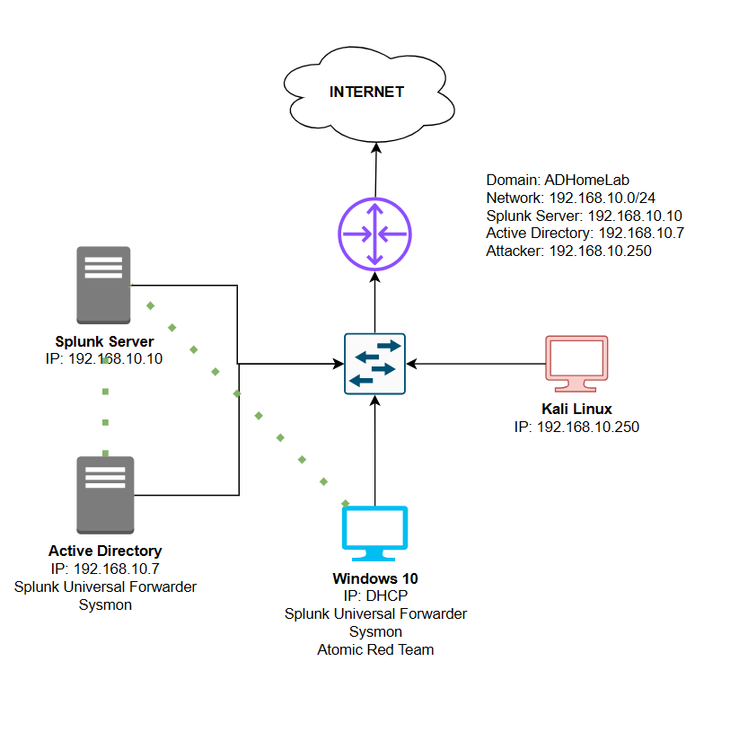

# Active Directory Home Lab Project 🖥️🔒

## Overview 📋

In this project, a Windows Server was configured with Active Directory and integrated with a SIEM (Splunk) for real-time telemetry updates. An attack scenario was simulated using Atomic Red Team, generating event logs in the SIEM, such as multiple failed login attempts. This setup enabled the detection of potential threats and facilitated rapid response actions by the security team.
 

    

## Key Components 🧩

- **Active Directory**: [Windows Active Directory](https://learn.microsoft.com/en-us/windows-server/identity/ad-ds/get-started/virtual-dc/active-directory-domain-services-overview) 
- **SIEM**: [Splunk](https://www.splunk.com/) 
- **Atomic Red Team**: [ART](https://github.com/redcanaryco/invoke-atomicredteam) 
- **Crowbar**: [Crowbar](https://github.com/galkan/crowbar) (Brute Forcing Tool) 
- **Environment**: ( VirtualBox )
  - **Windows [ TARGET ]**: [Windows VM](https://www.microsoft.com/en-in/software-download/windows10?msockid=3d3ec9e847f867f524e8dce046fe662e) 
  - **Kali Linux [ ATTACKER ]**: [Kali Linux](https://www.kali.org/get-kali/#kali-platforms) 
  - **Splunk Server**: [Ubuntu Server](https://ubuntu.com/download/server) 
  - **Active Directory Server**: [Windows Server 2022](https://www.microsoft.com/en-us/evalcenter/download-windows-server-2022?msockid=3d3ec9e847f867f524e8dce046fe662e) 

## Project Features ✨

- **Active Directory Configuration**: Integrated Windows Server with Active Directory to manage users, groups, and security policies effectively. 
- **SIEM Integration**: Seamlessly integrated with Splunk to provide real-time telemetry updates and centralized logging for enhanced monitoring. 
- **Attack Simulation**: Utilized Atomic Red Team to simulate attack scenarios, generating realistic event logs to test detection capabilities. 
- **Threat Detection and Response**: Equipped the security team to implement swift response actions based on detected anomalies. 

## Workflow 🔄

1. Target machine and Windows Active Directory Server sends telemetry to Splunk server.
2. Crowbar is used to simulate a Brute Force attack. 
3. AtomicRedTeam also used to test various attacks. 
4. Telemetry received on Splunk web interface. 

## Benefits 🎉

- Enhanced ability to detect and respond to potential threats in real time 
- Consolidation of event telemetry in Splunk streamlines incident detection and analysis 
- Simulation of attacks allows for identification of vulnerabilities before they can be exploited 
- Rapid response capabilities minimize the impact of security incidents 
- The integration can easily adapt to growing organizational needs and additional security tools 

## Detailed Project Documentation 📄

For a comprehensive understanding of the project, including detailed setup instructions and in-depth explanations of each component, please refer to detailed project documentation:

[Project_Documentation.pdf](./AD_Home_Lab_Project.pdf)

This PDF provides step-by-step guidance on setting up the environment, configuring Active Directory and Splunk, and implementing the workflow.

## Resources 📚

- [Active Directory](https://learn.microsoft.com/en-us/windows-server/identity/ad-ds/get-started/virtual-dc/active-directory-domain-services-overview) 
- [Splunk Documentation](https://docs.splunk.com/Documentation) 
- [Crowbar GitHub Repository](https://github.com/galkan/crowbar) 
- [Atomic Red Team GitHub Repository](https://github.com/redcanaryco/invoke-atomicredteam) 

> **Note:** This lab, containing all virtual machines, was configured on the same NAT network named **'AD-Home-Lab'** with the IPv4 prefix **"192.168.10.0/24"** and DHCP enabled. Please ensure that all virtual machines' network settings are changed to this NAT configuration and their IP addresses are updated according to the workflow diagram specified. 🌐
