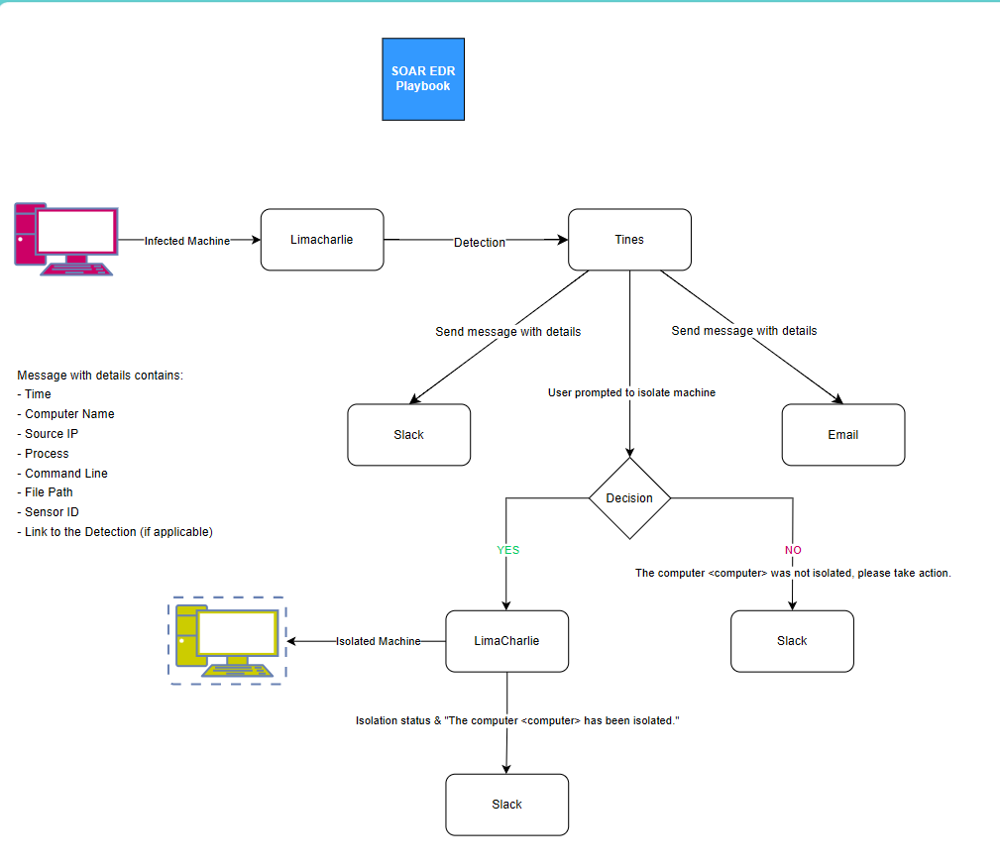

# SOAR_EDR_Project : Automated Threat Detection and Response 🚨🤖

## Overview 📋

This project demonstrates the implementation of a Security Orchestration, Automation, and Response (SOAR) solution integrated with Endpoint Detection and Response (EDR) capabilities. By combining the power of SOAR and EDR technologies, we've created an automated system for detecting and responding to potential security threats with minimal human intervention.

## Key Components 🧩

- **EDR**: [LimaCharlie](https://limacharlie.io/) 
- **SOAR**: [Tines](https://www.tines.com/) 
- **Simulated Threat**: [Lazagne](https://github.com/AlessandroZ/LaZagne) (open-source password recovery tool) 
- **Environment**: [Windows VM](https://www.microsoft.com/en-us/windows-server) on VmWare 

## Features ✨

- Custom threat detection rules 
- Automated alert generation and distribution 
- Multi-channel notifications (Slack and Email) 
- User-in-the-loop decision making for critical actions 
- Flexible response options (machine isolation or flagging for investigation) 
- Detailed event logging for forensics 

## Workflow 🔄

1. Threat detection on endpoints 
2. Alert generation and processing 
3. Information extraction and notification 
4. User decision prompt 
5. Automated response actions 

## Benefits 🎉

- Rapid threat response 
- Consistent handling of security incidents 
- Scalable solution for multiple simultaneous threats 
- Flexible and adaptable to evolving threat landscapes 
- Improved visibility into security events 

## Detailed Project Documentation 📝

For a comprehensive understanding of the project, including detailed setup instructions and in-depth explanations of each component, please refer to detailed project documentation:

[Project_Documentation.pdf](./SOAR_EDR_Project.pdf) 📄

This PDF provides step-by-step guidance on setting up the environment, configuring LimaCharlie and Tines, and implementing the automated workflow.

## Resources 📚

- [LimaCharlie Documentation](https://docs.limacharlie.io/) 📖
- [Tines Documentation](https://www.tines.com/docs) 📘
- [Lazagne GitHub Repository](https://github.com/AlessandroZ/LaZagne) 🔗
- [Windows Documentation](https://learn.microsoft.com/en-us/windows/) 💡
